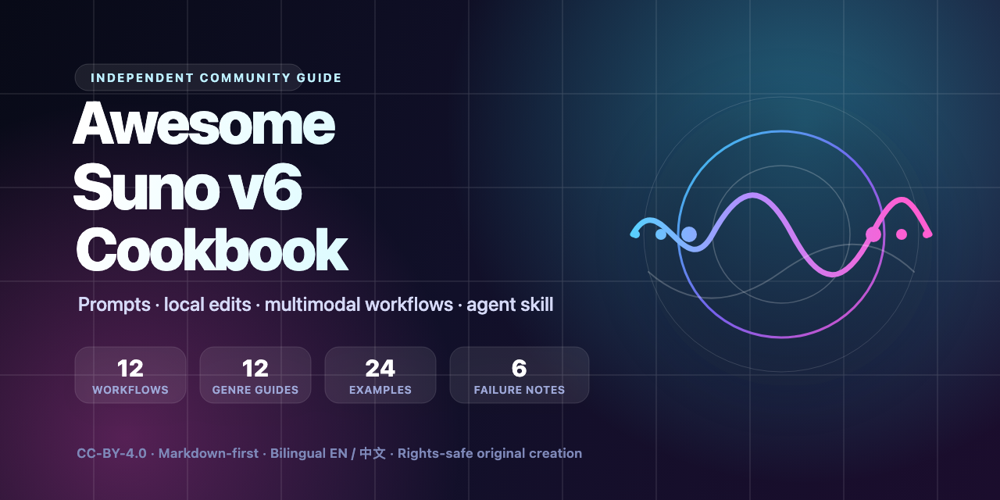

# Awesome Suno v6 Cookbook

A community cookbook for Suno v6 prompting, local lyric edits, multimodal creation, owned-source mashups, and practical song-building workflows.

[中文入口](./README.zh-CN.md) · [Contributing](./CONTRIBUTING.md) · [Safety and copyright](./docs/safety-and-copyright.md) · [CC-BY-4.0](./LICENSE)

> **Independent community project.** This repository is a community resource. It is not affiliated with, endorsed by, or certified by Suno.

> **Safety boundary:** Use only text, audio, images, video, voice recordings, and stems that you own or have permission to use. Do not upload commercial releases, ripped media, unauthorized samples, or requests designed to impersonate a real person.

## Quick start

1. Pick a model from the [Model Router](./docs/model-router.md).
2. Choose a recipe from [Edit and Mashup Workflows](./docs/edit-and-mashup-workflows.md).
3. Add genre language from the [Genre Playbook](./docs/genre-playbook.md).
4. Copy a ready-to-adapt case from [Examples](./library/examples/).
5. If a result fails, diagnose it with [Failure Notes](./library/failure-notes/).
6. Use the Markdown-only agent skill: [`suno-v6-songwriter`](./agents/skills/suno-v6-songwriter/SKILL.md).
7. Preparing a launch? Use the [GitHub Launch Kit](./docs/launch-kit.md).

## What changed in v6

See [What is new in v6](./docs/what-is-new-in-v6.md) for an evidence-labeled summary. The official capability baseline is Suno's announcement: <https://suno.com/blog/introducing-v6>.

At a high level, v6 adds practical routes for:

- choosing between `v6`, `v6-wild`, and `v6-mini`;
- natural-language local lyric and section edits;
- voice memo and source-audio based creation;
- sampling, isolation, and rebuilding around a useful layer;
- combining multiple owned materials;
- text, audio, image, and video inputs.

Interface availability and plan access may change; check Suno's product for current details.

## Best starting points

| I want to... | Start here |
|---|---|
| Choose the right model | [Model Router](./docs/model-router.md) |
| Write a better first prompt | [Prompt Anatomy](./docs/prompt-anatomy.md) |
| Replace one line or section | [Edit and Mashup Workflows](./docs/edit-and-mashup-workflows.md) |
| Turn a voice memo into a song | [Voice Memo to Song](./library/workflows/06-voice-memo-to-song.md) |
| Build from an owned riff | [Sample Riff to Beat](./library/workflows/08-sample-riff-to-beat.md) |
| Combine owned sources safely | [Owned-Source Mashup](./library/workflows/10-owned-source-mashup.md) |
| Improve Mandarin or bilingual singing | [Chinese Lyrics](./docs/chinese-lyrics.md) |
| Fix a bad generation | [Failure Diagnosis](./library/workflows/12-failure-diagnosis.md) |

## Library

- [12 workflow recipes](./docs/edit-and-mashup-workflows.md) — creation, editing, sampling, isolation, mashup, Chinese, and repair.
- [12 genre playbooks](./docs/genre-playbook.md) — instrumentation, vocal direction, avoid lists, and mini recipes.
- [24 original examples](./library/examples/) — copy-ready cases with evidence metadata.
- [6 failure notes](./library/failure-notes/) — common symptoms, causes, conservative repairs, and exploratory repairs.
- [Agent skill](./agents/skills/suno-v6-songwriter/SKILL.md) — dependency-free instructions for agents that help write Suno v6 prompts.

## Evidence labels

| Label | Meaning |
|---|---|
| `official` | Directly stated by an official Suno source |
| `official-informed` | Practical prompt advice derived from an official capability |
| `community-tested` | Supported by a documented reproducible community test |
| `working-hypothesis` | Untested practical advice that needs listening tests |
| `legacy-v5` | Older V5/V5.5 guidance that may need v6 retesting |

The required metadata format for examples is documented in [Case Schema](./docs/case-schema.md).

## Repository principles

- Markdown-first v0.1: static docs and visual assets, with no package manager, runtime dependency, API client, browser automation, or media upload tool.
- Evidence labels separate official facts from prompts that still need testing.
- Original cases avoid commercial lyrics and named-artist imitation.
- Source workflows begin with ownership and permission.
- The English README is the global entry point; the Chinese README serves Chinese-speaking creators.

## Contribute

Issues and pull requests are welcome. Read [CONTRIBUTING.md](./CONTRIBUTING.md) before adding a workflow, genre, example, failure note, or skill reference.

## License

Text content is licensed under [CC-BY-4.0](./LICENSE). Trademarks belong to their respective owners.
